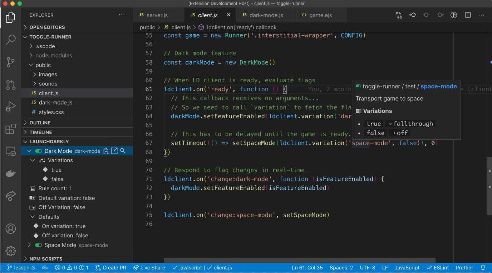
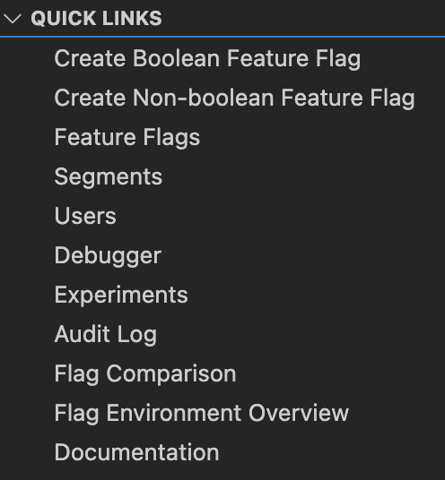
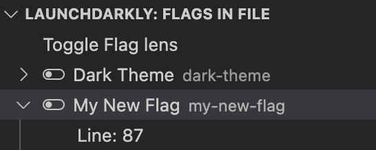
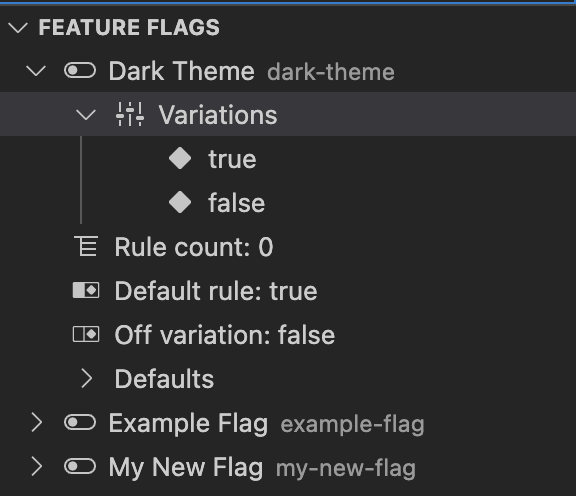
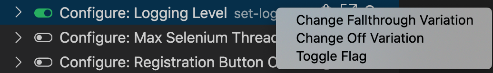

# LaunchDarkly for Visual Studio Code

The LaunchDarkly VSCode extension provides handy utilities that make it easier to use LaunchDarkly while you're coding. Now, you can see details about feature flags defined in your code, toggle them on or off, search for usage, see all possible flag variations and more.

## Features

- Feature flag details tooltip on hover
- Flag name autocomplete
- Open feature flags in LaunchDarkly (Default keybind: `ctrl+alt+g`/`⌘+alt+g`)
- [Feature flag explorer](#feature-flag-explorer): view a list of your feature flags and their settings in the explorer view
- [Create Boolean Flag](#create-boolean-flag)
- [Quick Links](#quick-links) to LaunchDarkly.
- [Flags in File](#flags-in-file)

Read our official documentation about this extension at <https://docs.launchdarkly.com/integrations/vscode>

### Hover
Show LaunchDarkly feature flag information right in your code. Anywhere a feature flag key is wrapped in string delimiters or if your application leverages [Code References](https://docs.launchdarkly.com/home/code/code-references) you can find aliases throughout the code base and a informational hover will appear when you mouseover them.

### Create Boolean Flag
*Using Command Palette (CMD/CTRL + Shift + P)* &rarr; `LaunchDarkly: Create Boolean Flag`     

Create a boolean feature flag and have it automatically copied to your clipboard without leaving VSCode.

Information required:
* Flag name 
* Flag key, name from step 1 will convert to a flag key in the same format as the LaunchDarkly UI handles it.
* SDK Availability

### Toggle Feature Flag
Change the enabled state of a feature flag without moving your hands from your keyboard.

*Using Command Palette (CMD/CTRL + Shift + P)* &rarr; `LaunchDarkly: Toggle Flag`

You can select from a list of all the feature flags in the project. The most recently toggled feature flags will be at the top of the list.

### Quick Links
Each link to will open your browser to specific pages in LaunchDarkly UI.

### Flags in File
 List of all flags found in the file. Added/Removed flags will not show until switching to another file and back.
 

### Feature Flag Explorer
The feature flag explorer will automatically refresh whenever environment-specific configuration updates are made, like turning on your flag or adding a rule. For any changes that affect all environments, such as adding tags, the explorer can be manually refreshed.

New flags will automatically be added to the end of the feature flag list until next reload of the application.

Flag names in the treeview can be right-clicked where you can update a flag's state, default rule when on, and default off variation
 
 

## Contributing

LaunchDarkly for Visual Studio Code is an [open source project](https://github.com/launchdarkly/ld-vscode). If you experience any issues, please [log an issue on our issue tracker](https://github.com/launchdarkly/ld-vscode/issues). If you'd like to contribute, we're happily taking pull requests.
