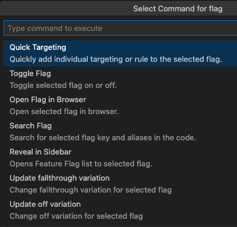

# LaunchDarkly for Visual Studio Code

[](https://marketplace.visualstudio.com/items?itemName=launchdarklyofficial.launchdarkly)
[](https://marketplace.visualstudio.com/items?itemName=launchdarklyofficial.launchdarkly)
[](https://marketplace.visualstudio.com/items?itemName=launchdarklyofficial.launchdarkly)
[](https://marketplace.visualstudio.com/items?itemName=launchdarklyofficial.launchdarkly)

The LaunchDarkly VSCode extension provides utilities that make it easy to work with feature flags using LaunchDarkly without ever leaving VSCode. See details about feature flags defined in your code, toggle them on or off, search for usage, see all possible flag variations and more.


## Authentication

The LaunchDarkly VS Code extension requires authentication using a **Personal Access Token** with **Writer** permissions or higher.

#### Important Notes:
- **Personal tokens only**: Service tokens are not supported
- **Permissions**: Your token must have permissions to perform actions available in the extension. Reader roles will be able to view flags but not perform any actions.
- **Token scope**: The token should have access to the projects and environments you want to work with

#### [Creating an Access Token](https://launchdarkly.com/docs/home/account/api-create#create-access-tokens)


#### Sign in:

1. Open VS Code with the LaunchDarkly extension installed
2. Use the Command Palette (`Cmd/Ctrl + Shift + P`)
3. Run `LaunchDarkly: Sign In`
4. Select your LaunchDarkly instance (Commercial, Federal, EU, or Other)
5. Paste your Personal Access Token when prompted


## Features

- Feature flag details tooltip on hover
- Flag name autocomplete
- Open feature flags in LaunchDarkly (Default keybind: `ctrl+alt+g`/`⌘+alt+g`)
- [Feature flag explorer](#feature-flag-explorer): view a list of your feature flags and their settings in the explorer view
- [Create Boolean Flag](#create-boolean-flag)
- [Flag Actions](#flag-actions-command)
- [Quick Links](#quick-links) to LaunchDarkly
- [Flags in File](#flags-in-file)
- [Flag Lens](#flag-lens)
- [Dev Server Integration](#dev-server-integration): connect to a local dev-server for local development and testing with local flag values and overrides

Read our official documentation about this extension at <https://docs.launchdarkly.com/integrations/vscode>

### Hover
Show LaunchDarkly feature flag information right in your code. Anywhere a feature flag key is wrapped in string delimiters or if your application leverages [Code References](https://docs.launchdarkly.com/home/code/code-references) you can find aliases throughout the code base and a informational hover will appear when you mouseover them.


### Create Boolean Flag
*Using Command Palette (CMD/CTRL + Shift + P)* &rarr; `LaunchDarkly: Create Boolean Flag`     

Create a boolean feature flag and have it automatically copied to your clipboard without leaving VSCode.

Information required:
* Flag name 
* Flag key, name from step 1 will convert to a flag key in the same format as the LaunchDarkly UI handles it.
* SDK Availability


### Flag Actions Command
Use the `LaunchDarkly: Flag Actions` command to bring up a menu of options that you can choose from to interact with your feature flags.



### Toggle Feature Flag
Change the enabled state of a feature flag without moving your hands from your keyboard.

*Using Command Palette (CMD/CTRL + Shift + P)* &rarr; `LaunchDarkly: Toggle Flag`

You can select from a list of all the feature flags in the project. The most recently toggled feature flags will be at the top of the list.


### Quick Links
Each link to will open your browser to specific pages in LaunchDarkly UI.


### Flags in File
 List of all flags found in the file. Added/Removed flags will not show until switching to another file and back.
 


### Feature Flag Explorer
The feature flag explorer will automatically refresh whenever environment-specific configuration updates are made, like turning on your flag or adding a rule. For any changes that affect all environments, such as adding tags, the explorer can be manually refreshed.

New flags will automatically be added to the end of the feature flag list until next reload of the application.


Flag names in the treeview can be right-clicked where you can update a flag's state, default rule when on, and default off variation
 
 

### Flag Lens
The Flag Lens functionality shows insights about the usage and status of LaunchDarkly feature flags directly in the code. For a given feature flag in the codebase, the Flag Lens displays:

__Flag Name__: The feature flag's name as it appears in LaunchDarkly.
__Flag Status__: Whether the flag is currently enabled or disabled.
__Variation Information__: Which variation or value of the flag is currently being served.

This is OFF by default. It can be enabled through Settings > LaunchDarkly Extension > Enable Flag Lens.

### Dev Server Integration

The extension integrates with the [LaunchDarkly CLI dev-server](https://launchdarkly.com/docs/guides/flags/ldcli-dev-server-reference) for local development and testing. When connected, the extension operates in a hybrid mode: it continues using your LaunchDarkly account for API calls and flag metadata while fetching flag values and streaming updates from the local dev-server.

#### Prerequisites

Install the [LaunchDarkly CLI](https://launchdarkly.com/docs/home/getting-started/setting-up/quickstart#install-the-launchdarkly-cli) and start the dev-server:

```bash
ldcli dev-server
```

By default, the dev-server runs at `http://localhost:8765`. You can configure a custom URI in Settings > LaunchDarkly Extension > Dev Server URI.

#### Connecting

1. Open the Command Palette (`Cmd/Ctrl + Shift + P`)
2. Run `LaunchDarkly: Connect to Dev Server`
3. Confirm the URI or choose "Change URI" to enter a custom one

The status bar will display a dev-server indicator when connected. If the dev-server becomes unavailable, the extension will prompt you to retry, disconnect, or dismiss.

#### Features when connected

- **Live flag values**: The Feature Flag Explorer shows flag values from the dev-server instead of LaunchDarkly cloud, updated in real-time via streaming.
- **Override management**: Set or remove flag value overrides directly from the extension. Right-click any flag in the explorer and select "Set Dev Server Override" to choose from available variations or enter a custom value. Overridden flags are marked with a visual indicator.
- **Hover and Code Lens**: Hover tooltips and Flag Lens annotations reflect dev-server values and indicate when a flag is overridden.
- **Automatic reconnection**: If the extension was previously connected to the dev-server, it will attempt to reconnect on startup.

#### Commands

| Command | Description |
|---------|-------------|
| `LaunchDarkly: Connect to Dev Server` | Connect to a running dev-server instance |
| `LaunchDarkly: Disconnect from Dev Server` | Disconnect and return to LaunchDarkly cloud values |
| `LaunchDarkly: Set Dev Server Override` | Set a local override value for a flag (available when connected) |
| `LaunchDarkly: Remove Dev Server Override` | Remove an existing override for a flag (available when connected) |

#### Disconnecting

Run `LaunchDarkly: Disconnect from Dev Server` from the Command Palette. Flag values will revert to those served by LaunchDarkly.

## Contributing

LaunchDarkly for Visual Studio Code is an [open source project](https://github.com/launchdarkly/ld-vscode). If you experience any issues, please [log an issue on our issue tracker](https://github.com/launchdarkly/ld-vscode/issues). If you'd like to contribute, we're happily taking pull requests.

## Development

### Prerequisites
- Node.js (version 18 or higher)
- [Visual Studio Code](https://code.visualstudio.com/)

### Getting Started

**Install dependencies**
   ```bash
   npm install
   ```

**Build the extension**
   ```bash
   npm run compile
   ```

**Start debugging**
   - Press `F5` or go to `Run > Start Debugging`
   - This will open a new VS Code window with the extension loaded in development mode
   - The extension will be available as "LaunchDarkly" in the new window

### Development Workflow

- **Watch mode**: Run `npm run watch` to automatically recompile on file changes
- **Testing**: Run `npm test` to execute the test suite
- **Linting**: Run `npm run lint` to check code style

### Debugging

- Set breakpoints in the TypeScript source files
- Use the Debug Console in the host VS Code window to inspect variables
- Check the Developer Tools (`Help > Toggle Developer Tools`) in the extension development host for console output


