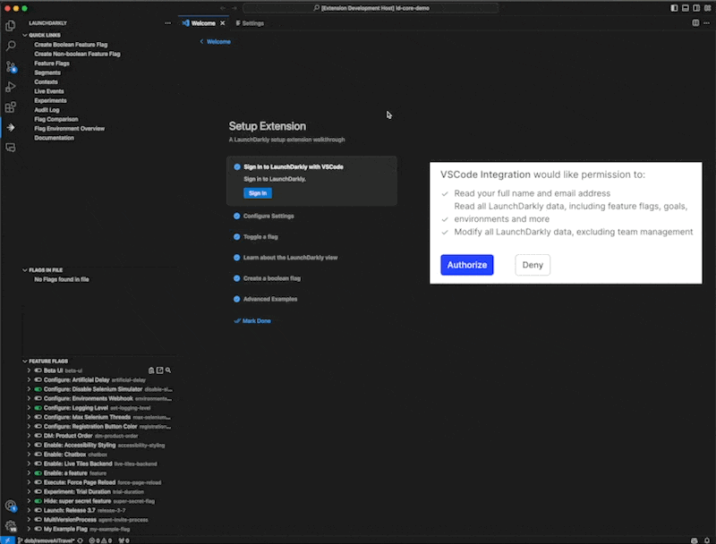

*** Create Boolean Flag ***

Command Palette - LaunchDarkly: Create Boolean Flag

You can enter:
* Flag Name
* Flag Key
* SDK Availability
* Pipeline

Once the flag is created the key will be copied to your clipboard. An optional VSCode Task will be called after the flag is created if the task is named `LDFlagGenerator`.

